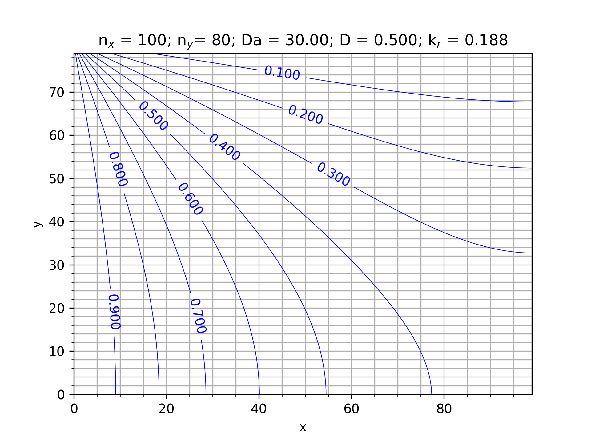

# Implementation of electrochemical boundary condition with Palabos

This program is a tutorial for implementing the boundary condition from [this article by Kang and co-workers](http://dx.doi.org/10.1029/2006WR005551) with a D2Q5 Lattice in Palabos (**pa**rallel **la**ttice **bo**ltzmann **s**olver).

### Classes

#### KangBCTop_BDY

This class inherits from **BoxProcessingFunctional2D_L** and implements the Kang Boundary condition from *An improved lattice Boltzmann model for multicomponent reactive transport in porous media at the pore scale* via the method *process*. The D2Q5 boundary condition is not derived in this paper and differs slightly from the D2Q4 and D2Q9 based on the different weights. The other methods of this class are the semi-generic methods that are described for writing a data processor.

### Functions

#### assign_params

Implementation of section 11.4 from Palabos User Guide as a function to read the *params.xml* file.

#### computeNormalizedConcentration

This function evaluates the 'normalized solute concentration' from page 7 of Kang's manuscript (about half-way down the page on the left side).

#### writeVTK

Writes the density (concentration - [SCALAR field]) and normalizedConcentration to vtk format (in the tmp/ directory).

#### rectangularDomainSetup

This function:
  1. Defines the constant temperature (scalar - Concentration) on the west boundary
  2. Calls the function **integrateProcessingFunctional**, which assigns *KangBCTop_BDY* to the top boundary
  3. Initializes the domain to equilibrium (Ceq in the interior of the domain with zero velocity)
  4. Initializes the lattice

### main

Main first sets the output directory, instantiates the simulation variables and reads them from *params.xml* with a call to *assign_params*.  &#x03C4; is then calculated (1/&#x03C9;) and the rate constant (equation 50 from Kang). The lattice (adLattice - advection-diffusion lattice) is then instantiated with ADYNAMICS), likewise the MultiblockScalarField which holds the normalized solute concentration is instantiated. Next, a pointer to an OnLatticeAdvectionDiffusionBoundaryCondition2D is instantiated.  The lattice, dereferenced boundary condition, nx, ny, boundary concentration, equilibrium concentration and rate constant are then passed to rectangularDomainSetup. The convergence iteration spacing , iterator (iT) and instantiates a Valuetracer which tracks the 'convergence' (this was copied from aneurysm example). Then  &#x2192; time stepping. After the end of the time stepping the normalized solute concentration is calculated and dumped to the 'lbm_contour.dat' file.